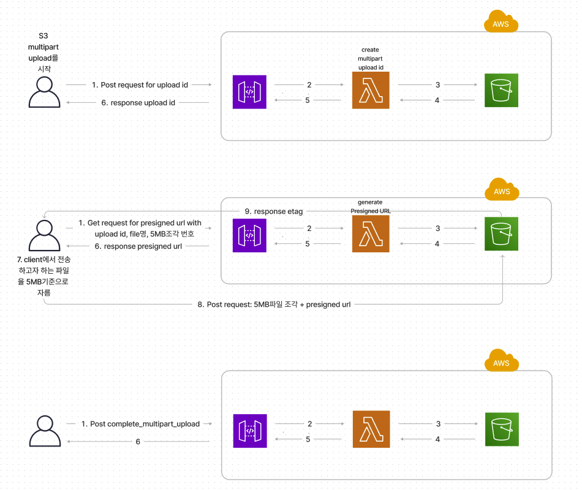

# S3-multipart-upload

- when
  - 
  - S3에 업로드하려는 파일(객체)의 크기가 **100MB**이상인 경우, 단일 작업에서 객체를 업로드하는 대신 멀티파트 업로드 사용을 고려할 것
- 구현 방법 
    -
    1. 멀티파트 업로드 시작
       - 멀티파트 업로드 시작 요청을 전송하면 Amazon S3는 멀티파트 업로드에 대한 고유 식별자인 **upload Id**와 함께 응답을 반환합니다.
    2. 부분 업로드
       - 파일을 특정 크기로 분할 하여 부분 업로드를 진행한다. 부분 업로드할 때 upload id와 함께 part number(부분 번호)를 지정해야 한다. part number를 사용하여 업로드하는 객체에서 각 부분과 그 위치를 고유하게 식별한다. 부분을 업로드할 때마다 Amazon S3는 그 응답으로 엔터티 태그(ETag)헤더를 반환한다. 각 부분 업로드에 대해 부분 번호와 ETag 값을 기록해야 한다. 이후 멀티파트 업로드를 완료하기 위한 요청에 이러한 값을 포함해야 하기 때문이다
    3. 멀티파트 업로드 완료
       - 멀티파트 업로드를 완료하면 Amazon S3는 부분 번호를 바탕으로 오름차순으로 각 부분을 결합하여 객체를 완성한다.

- 구현 상세
  - 
    - AWS credential 정보가 클라이언트에 있으면 안되므로 credential을 가지고 s3에 접근하여 정보를 조회하는 부분들을 Lambda로 구성
    1. **v1_initiate_multipart_upload API호출**
       - upload id를 획득하기 위해 호출
    2. 클라이언트단에서 기기에 저장된 파일을 읽어들여 5MB로 파일을 쪼갬
       - Lambda함수의 이벤트 소스로 API Gateway를 사용할 경우, Lambda함수로 전달되는 이벤트 객체의 최대 크기는 6MB이다.
    3. 반복문을 돌며 각 chunk마다 presigned url을 획득하기 위해 **v1_upload_multipart_upload API호출**
    4. 부분 업로드 진행(in 3번 반복문)
       - 응답받은 presigned url과 upload id, part_number를 가지고 s3에 직접 호출
       - 부분을 업로드 할 때마다 S3는 그 응답으로 ETag를 header에 담아서 반환
    5. 멀티파트 업로드 완료
       - **v1_complete_multipart_upload API호출**
       - 멀티파트 업로드를 완료하면 Amazon S3는 part_number를 바탕으로 오름차순으로 각 부분을 결합하여 객체를 완성한다

- Pros & Cons
  - 
  - Pros
    - 조각난 부분들을 병렬적으로 업로드하여 처리량을 개선할 수 있다
    - 더 작아진 부분 크기는 네트워크 오류로 인해 실패한 업로드 재시작의 영향을 최소화 한다
    - S3에 객체를 생성하는 동안 업로드 할 수 있다
  - Cons
    - 복잡하다
    - 사이즈가 큰 파일을 업로드 하지 않을시, 오버 엔지니어링이 될 수 있다

- 기술 스택
  - 
  - python
  

- 아키텍처
  - 
    
     